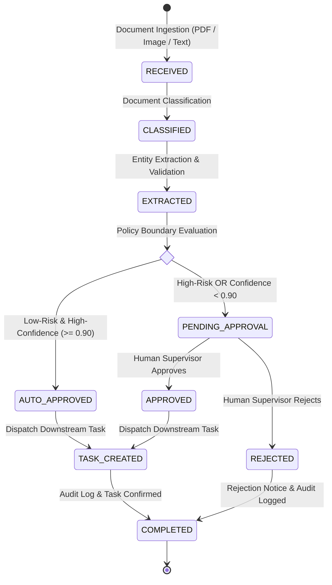
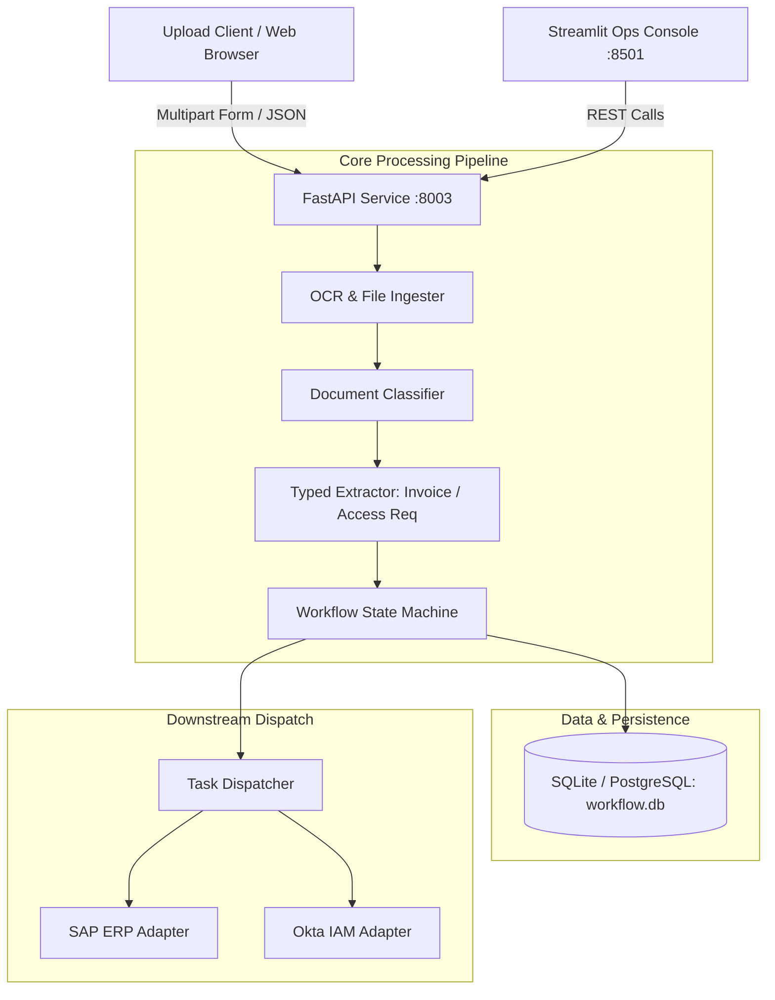

# Architecture & Design Document — Project 3: Document-to-Workflow Platform

## 1. System Overview

The **Document-to-Workflow Platform** is an enterprise ingestion, extraction, and orchestration service. It replaces ad-hoc manual email routing with an audited, deterministic state machine that extracts key operational entities from business documents, verifies them against automated compliance policies, and either auto-approves or halts execution for human sign-off before generating downstream enterprise actions (e.g. ERP payment scheduling or IAM access grants).

---

## 2. Finite State Machine Workflow

The document lifecycle is governed strictly by the following finite state machine:

---

## 3. Human Approval Gating Criteria

To protect enterprise operations, documents are gated based on explicit business rules:

| Document Type | Condition | Pipeline Route | Action Taken |
|---|---|---|---|
| **Invoice** | Total $< \$1,000$, Verified Vendor, Conf $\ge 0.90$ | `AUTO_APPROVED` | Dispatches SAP ERP payment task automatically |
| **Invoice** | Total $\ge \$1,000$ | `PENDING_APPROVAL` | Flags: *"Invoice total meets or exceeds $1,000 auto-approval threshold"* |
| **Invoice** | Unverified Vendor | `PENDING_APPROVAL` | Flags: *"Vendor is not in master supplier catalog"* |
| **Access Request** | Role = `read` or `write`, Conf $\ge 0.90$ | `AUTO_APPROVED` | Dispatches Okta IAM provisioning task automatically |
| **Access Request** | Role = `admin` | `PENDING_APPROVAL` | Flags: *"Elevated admin privilege requested. Requires IT Security Officer review"* |
| **Any Document** | Extraction Confidence $< 0.90$ | `PENDING_APPROVAL` | Flags: *"Confidence is below automated threshold"* |
| **Out-of-Scope** | Unknown document structure | `PENDING_APPROVAL` | Flags: *"Unrecognized document structure requires human operator triage"* |

---

## 4. Component Architecture

---

## 5. Data Models & Entity Relationships

- **Document (`documents` table):**
  - Unique ID (`DOC-XXXX`), SHA-256 digest, raw text, lifecycle status, document type, confidence scores, extracted JSON payload, and approval requirement flags.
- **Approval Record (`approvals` table):**
  - Historical log of human decisions, reviewer identity, notes/justification, and UTC timestamp.
- **Downstream Task (`tasks` table):**
  - Target system (`SAP_ERP`, `Okta_IAM`), task type, dispatched payload, and execution status.

---

## 6. Failure Modes & Safety Guarantees

1. **Catastrophic Action Prevention:**
   - No task is EVER created or dispatched to SAP or Okta while a document is in `PENDING_APPROVAL`.
   - Rejections permanently terminate the workflow without task generation.
2. **Idempotency & Duplicate Protection:**
   - Ingested files are hashed with SHA-256. Duplicate uploads can be matched and deduplicated.
3. **Audit Trail Integrity:**
   - Every state transition is recorded in the database with timestamps and operator identities.
