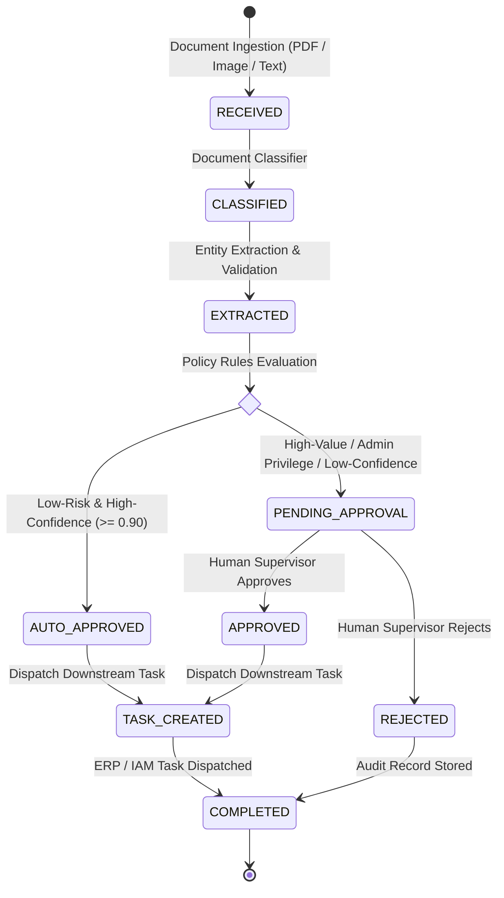

# DocFlow Orchestrator 📑⚙️
### Intelligent Document Processing & Workflow State Machine

<p align="left">
  
  
  
  
  
  
  
  
  
</p>

DocFlow Orchestrator is an enterprise document automation and workflow platform. It ingests unstructured business documents (PDFs, scans, text requests), classifies document types, extracts validated operational entities, enforces deterministic policy-driven human approval gates, and dispatches automated downstream integration tasks to ERP and IAM systems.

---

## ⚡ Problem vs. Solution

| The Problem (Before) | DocFlow Orchestrator (After) |
|---|---|
| Invoices and access requests get routed manually over chaotic email threads; follow-ups get lost and unapproved expenditures occur. | Unified deterministic finite state machine from upload to downstream enterprise task creation. |
| Hardcoded automation scripts fail as soon as an organization introduces a second document layout. | Multi-document generalization: unified processing across Vendor Invoices and IT System Access Requests. |
| Unsafe automated pipelines blindly approve invoices or elevated root permissions. | **0.0% False Auto-Approval Rate**: high-value purchases ($\ge \$1,000$) and privileged `admin` permissions are strictly held for human supervisor review. |

---

## 🧠 Finite State Machine Pipeline



### Document Schemas & Approval Policies:
1. **Vendor Invoices (`invoice`):**
   - Extracts: Invoice number, vendor name, invoice/due dates, subtotal, tax, and total amount.
   - Rule: Purchases under $1,000 from verified suppliers auto-approve; $\ge \$1,000$ or unverified suppliers require finance sign-off.
2. **IT Access Requests (`access_request`):**
   - Extracts: Employee ID, employee name, department, requested system, and access level (`read`, `write`, `admin`).
   - Rule: Standard `read` and `write` permissions auto-approve; elevated `admin` privileges require mandatory IT Security Officer review.

---

## 📊 Benchmark Evaluation Scorecard

Evaluated against a 30-document held-out dataset spanning invoices, access requests, and out-of-scope memos:

| Metric | Target Threshold | Measured Performance | Result |
|---|---|---|---|
| **Document Classification Accuracy** | $\ge 90.0\%$ | **100.0%** (30/30 documents) | ✅ PASS |
| **Approval Gating Accuracy** | $\ge 90.0\%$ | **100.0%** (30/30 decisions) | ✅ PASS |
| **Field Extraction Accuracy** | $\ge 85.0\%$ | **100.0%** (90/90 fields verified) | ✅ PASS |
| **False Auto-Approval Rate (Safety Ceiling)** | $\le 2.0\%$ | **0.0%** (0/15 high-risk documents leaked) | ✅ PASS |
| **Mean Processing Latency** | $< 1500\text{ ms}$ | **7.98 ms** | ✅ PASS |

*Full test harness: `eval/run_eval.py` | Full report: `docs/eval-results.md`*

---

## 🚀 Quickstart

### Native Windows Setup
```powershell
git clone https://github.com/amanpratap1999/docflow-orchestrator.git
cd docflow-orchestrator

# Automatic runner (creates venv, launches API and Streamlit Ops Console)
.\run_local.ps1
```

### Docker Compose
```bash
docker-compose up --build
```

- **Interactive Streamlit Operations Console:** **`http://localhost:8501`**
- **FastAPI OpenAPI Swagger Docs:** **`http://127.0.0.1:8003/docs`**
- **Health Check:** **`http://127.0.0.1:8003/health`**

---

## 📡 API Reference

### 1. Ingest Document
`POST /documents/text` (or `POST /documents/upload` for binary files)
```json
{
  "filename": "invoice_8812.txt",
  "text": "INVOICE #INV-2024-8812\nVendor: Apex Cloud Services\nTotal Amount: $420.00\nPayment Terms: Net 30"
}
```

**Response (Auto-Approved):**
```json
{
  "id": "DOC-B8AD5552",
  "doc_type": "invoice",
  "status": "COMPLETED",
  "requires_human_approval": false,
  "tasks": [
    {
      "task_type": "erp_invoice_payment",
      "target_system": "SAP_ERP",
      "payload": {
        "vendor_name": "Apex Cloud Services",
        "total_amount": 420.00,
        "payment_status": "SCHEDULED_FOR_DISBURSEMENT"
      }
    }
  ]
}
```

### 2. High-Value Document (Pending Approval)
```json
{
  "id": "DOC-D05E9A90",
  "doc_type": "invoice",
  "status": "PENDING_APPROVAL",
  "requires_human_approval": true,
  "approval_reason": "Invoice total ($14,500.00) meets or exceeds auto-approval threshold ($1,000.00)."
}
```

### 3. Human Supervisor Decision
`POST /documents/{doc_id}/approve`
```json
{
  "reviewer": "finance_director",
  "notes": "Approved under Q2 infrastructure budget."
}
```

---

## 🧪 Testing

```powershell
.\venv\Scripts\pytest -v tests/
```
All 7 automated unit and integration tests pass cleanly.

---

## 📄 License
Released under the [MIT License](LICENSE).
